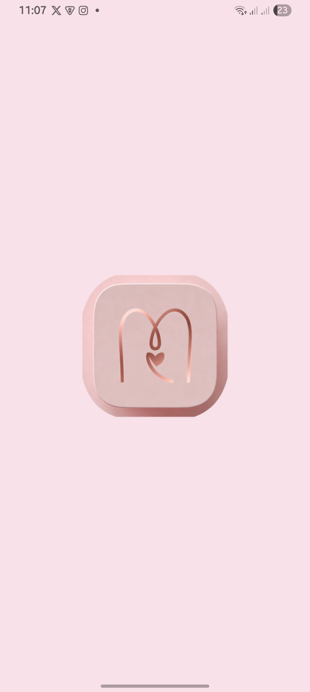
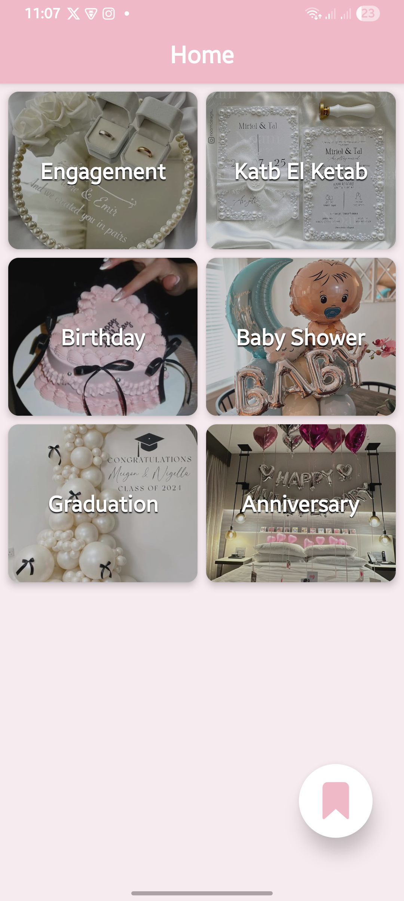
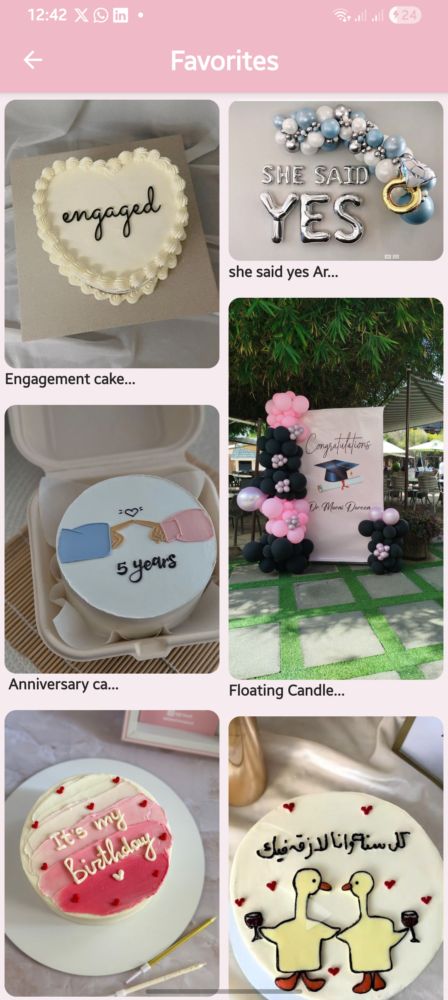
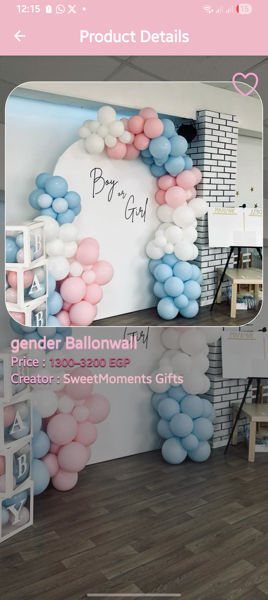
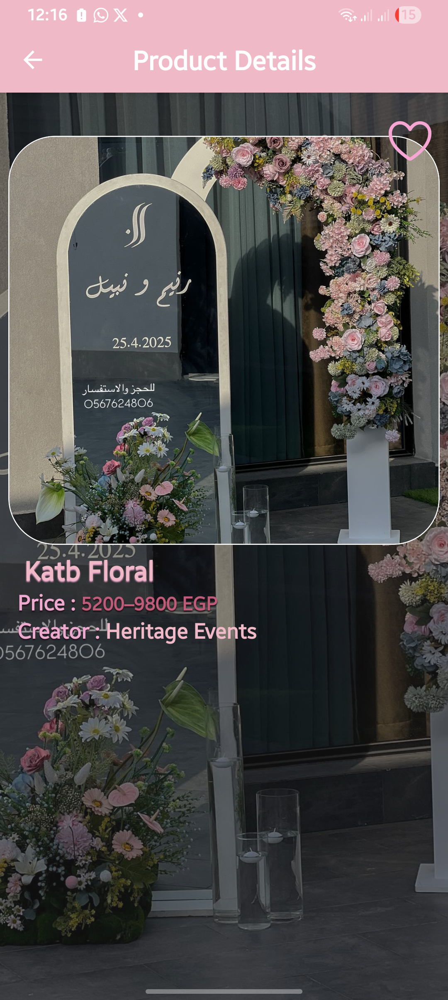
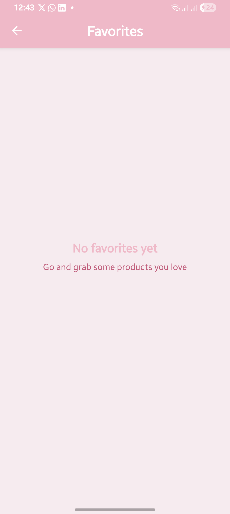

# Memora 💍

React Native mobile app for discovering and saving occasion decorations (engagements, katb el ketab, birthdays, baby showers, graduations, anniversaries, etc.).

Built with clean code, beautiful UI inspired by Pinterest, and smooth performance .

## Screenshots

<table>
  <tr>
     <td align="center">
      
       <b>Splash Screen </b>
    </td>
    <td align="center">
      
       <b>Home Screen</b>
    </td>
    <td align="center">
      
       <b>Favorites</b>
    </td>
  </tr>
  <tr>
    <td align="center">
      
       <b> Occasion grid </b>
    </td>
    <td align="center">
      
       <b>Occasion grid</b>
    </td>
    <td align="center">
      
       <b>Product details</b>
    </td>
  </tr>
  <tr>
    <td align="center">
      
       <b>Product details</b>
    </td>
    <td align="center">
      
       <b> Empty Favorites</b>
    </td>
     <td align="center">
      
       <b> Demo in Action</b>
    </td>
  </tr>
</table>

## Core Features

- Browse occasions with elegant grid cards
- Pinterest-style masonry grid for products per occasion
- Full-screen product details with dynamic image aspect ratio
- Save / unsave favorite decorations (persistent across sessions)
- Smooth navigation & splash screen
- Clean, reusable components & custom hooks

## Tech & Implementation Highlights

| Technology / Pattern                | Description                                                                    | 
| ----------------------------------- | ------------------------------------------------------------------------------ |
| **Expo + Dev Client**               | Built & run using `expo-dev-client` for native modules support                 |          |
| **React Navigation — Native Stack** | `@react-navigation/native-stack` for smooth, native-feeling screen transitions |
| **Custom Hook: useFavorites**       | Manages favorites list + AsyncStorage persistence                              | 
| **AsyncStorage** (local storage)    | Persistent favorites (can be swapped later with MMKV for speed)                | 
| **FlashList (masonry)**             | `@shopify/flash-list` with `masonry={true}` & `numColumns={2}`                 | 
| **Dynamic Image Aspect Ratio**      | `Image.getSize()` + `aspectRatio` style to prevent stretching                  | 
| **Splash Screen**                   | Customized via `expo-splash-screen` + `app.json` config                        | 
| **Consistent Theming**              | Central `colors.js` file + shadow/text effects for elegant UI                  | 
| **Pinterest-inspired Design**       | Rounded corners, overlays, text shadows, masonry layout, big hero images       | 
